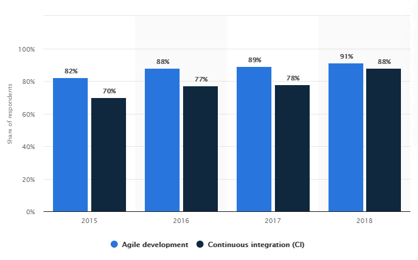

# TDD by Example | Kent Beck

[Test-Driven Development by Example](https://www.amazon.de/Test-Driven-Development-Example-Signature/dp/0321146530)

## Kurzzusammenfassung

Die vorliegende Projektarbeit beschäftigt sich mit der testgetriebenen Entwicklung und dessen Nutzen für Unternehmen. Hierbei wurde zunächst die Funktionsweise der testgetriebenen Entwicklung erarbeitet und beschrieben, um ein grundsätzliches Verständnis darüber zu erlangen. Im Anschluss wurde es dann mit dem herkömmlichen Testansatz auf die Komplexität, dessen Umfang, der Kosten, usw. verglichen um daraufhin einen potenziellen Nutzen abschätzen zu können.

Es stellte sich hierbei heraus, dass beide Testansätze ihre Vor- und Nachteile in gewissen Gesichtspunkten haben. Somit gibt es keine Allzwecklösung, sondern es kommt auf das jeweilige Projekt, dessen Ausmaße, Umfang und Ziel an, welcher Testansatz nun der jeweils bessere ist.

## Abstract

This paper deals with test-driven development and its benefits for companies. First, the functionality of test-driven development was elaborated and described in order to gain a basic understanding of it. Subsequently it was compared with the conventional test approach on the complexity, its extent, the costs and so on, to be able to estimate a potential benefit.

It turned out that both test approaches have their advantages and disadvantages in certain aspects. Thus there is no all-purpose solution, but it depends on the respective project, its extent, scope and goal, which test approach is the better one.

## Inhaltsverzeichnis

1. [Abkürzungsverzeichnis](#Abkürzungsverzeichnis)

2. [Einleitung](#Einleitung)

3. [Funktionsweise](#Funktionsweise)

4. [Vergleich](#Vergleich)

5. [Fazit](#Fazit)

6. [Literaturverzeichnis](#Literaturverzeichnis)

## Abkürzungsverzeichnis

- TDD _Test-Driven Development_
- TLD _Test-Last Development_
- XP _Extreme Programming_
- YAGNI _You Aren&#39;t Gonna Need It (dt. Du wirst es nicht brauchen)_

## Einleitung

Bei vielen Unternehmen wird heutzutage Code immer noch traditionell nach dem Test-Last-Ansatz getestet. Nach dem ein paar neue Ansätze zum Testen von Code im Laufe der Zeit entwickelt wurden, stellt sich nun die Frage, ob nicht ein anderer Ansatz als der Traditionelle eine gute Entscheidung für die Entwicklung von Anwendungen wäre. Ein Beispiel hierfür wäre die testgetriebene Entwicklung (engl. Test-Driven Development, TDD). Der Großteil der Entwickler sagt, allerdings noch, dass der Einsatz hiervon in der Industrie noch durch unzureichende Erfahrung in diesem Bereich eingeschränkt wird.

In der folgenden Arbeit soll möglicher Nutzen bei Einsatz von TDD herausgearbeitet werden.

TDD ist eine Software-Engineering-Praxis, die verlangt, dass Tests vor dem zu validierenden Code geschrieben werden. Aus der agilen Welt kommend, in der es eine grundlegende Praxis der Extreme-Programming (XP) ist, wird TDD heute als eigenständige Disziplin anerkannt, die auch außerhalb des agilen Kontexts eingesetzt wird.

Die agile Entwicklung hat sich in den letzten Jahren kontinuierlich weiterentwickelt (_siehe Abbildung 1_) und zu neuen und pragmatischen Praktiken geführt, die darauf abzielen, dem Kunden so schnell wie möglich ein Programm zu liefern, das seinen Anforderungen entspricht. Für dieses Problem bieten traditionelle Methoden, einen Test-Last-Ansatz, bei dem die Tests nach dem Anwendungscode geschrieben werden. Dieser Ansatz hat im Laufe der Zeit seine Grenzen aufgezeigt, da im besten Fall die geschriebenen Tests an den Code angepasst werden und nicht umgekehrt. Im schlimmsten Fall hingegen werden diese Tests gar nicht geschrieben, da der Code korrekt zu funktionieren scheint.

_Abbildung 1: Einführung von agiler Entwicklung und kontinuierlicher Integration in die Softwareentwicklung weltweit von 2015 bis 2018_

TDD-Befürworter sind sich bewusst, dass die Investition, die heute in Tests getätigt wird, in der Zukunft beim Hinzufügen neuer Funktionen oder bei größeren Änderungen größtenteils zurückerstattet wird. Daher verfolgt TDD einen Test-First-Ansatz, bei dem die Tests vor dem Code geschrieben werden, dessen einziger Grund die erfolgreiche Ausführung dieser Tests sein wird. Diese Idee wurde erstmals 1957 im Buch „Digital Computer Programming&quot; von D.D. McCracken beschrieben. Hierbei heißt es, „Sie nehmen das Eingabeband, geben das erwartete Ausgabeband manuell ein und programmieren dann, bis das tatsächliche Ausgabeband mit der erwarteten Ausgabe übereinstimmt&quot;. Mitte der 1990er Jahre formalisierte Kent Beck diese Idee und machte sie zu einer der Säulen der XP-Methodik. Im Jahre 2003 kodifizierte Kent Beck die Praxis hinter TDD mit der Veröffentlichung des Buches „Test-Driven Development: By Example&quot;.

## Funktionsweise

Bei TDD richtet sich der Entwicklungszyklus (_siehe Abbildung 2_) nach den Ergebnissen der bestimmten Testfälle. Mit dem Zyklus wird sichergestellt, dass alle Anforderungen an die Software vor dem Produktivgehen erfüllt sind. Hierbei wird der geschriebene Code so lange refaktorisiert und neu getestet, bis dieser nicht mehr als fehlerhaft angezeigt wird. Durch diesen Zyklus wird die Software schrittweise mit neuen Funktionen erweitert. Im Folgenden wird dieser Zyklus genauer erläutert.

_Abbildung 2: Test-Driven Development Entwicklungszyklus. Diese Sequenz basiert auf dem Buch Test-Driven Development by Example (Eigene Darstellung)_

**Neuen Test hinzufügen**

Bei TDD beginnt jede neue Funktion mit dem Schreiben eines Tests. Dieser Test muss zwangsläufig fehlschlagen, da er vor der Implementierung der Funktion geschrieben wurde. Um einen Test zu schreiben, muss der Entwickler die Spezifikation und Anforderungen der Funktion klar verstehen. Der Entwickler kann dies durch Anwendungsfälle erreichen, um die Anforderungen abzudecken. Dies kann auch eine Modifikation eines vorhandenen Tests sein. Dies ist ein Unterschiedsmerkmal zwischen TDD und dem Schreiben von traditionellen Komponententests nach dem Schreiben des Codes.

**Sicherstellung des fehlgeschlagenen Tests**

Um sicherzustellen, dass der Test richtig funktioniert und nicht fälschlicherweise bestanden wird, sollte der Test bevor der Code implementiert wird durchgeführt werden. Dieser Schritt testet auch den Test selbst. Es schließt somit die Möglichkeit aus, dass der neue Test immer besteht und daher wertlos ist. Der neue Test sollte auch aus dem erwarteten Grund fehlschlagen.

**Code schreiben**

Der nächste Schritt besteht darin, den Code zu schreiben, der das Bestehen des Tests bewirkt. Der neue Code, der zu diesem Zeitpunkt geschrieben wurde, ist nicht perfekt und kann beispielsweise den Test auf unelegante Weise bestehen. Das ist akzeptabel, weil spätere Schritte den Code verbessern werden.

Zu diesem Zeitpunkt besteht der einzige Zweck des geschriebenen Codes darin, den Test zu bestehen. Es sollten somit keine weiteren Funktionalitäten hinzugefügt werden. Dies verhindert, dass unnötiger und nicht spezifizierter Code geschrieben wird, wodurch die YAGNI-Funktionalität vermieden wird.

**Test durchführen**

Wenn jetzt alle Testfälle bestanden sind, kann der Entwickler sicher sein, dass der Code alle getesteten Anforderungen erfüllt. Jetzt kann sich der Entwickler der Bereinigung des Codes widmen.

**Refactoring**

Der letzte Schritt besteht darin, den Code aufzuräumen, Duplizierungen zu entfernen und dass die Variablen- und Methodennamen ihre aktuelle Verwendung darstellen. Bei erneuter Testdurchführung sollte durch das Refactoring keine vorhandene Funktion beschädigt worden sein.

Das Konzept des Entfernens von Duplikaten ist ein wichtiger Aspekt jedes Software-Designs. In diesem Fall gilt dies auch für das Entfernen von Duplikaten zwischen Testcode und Produktionscode, z.B. magische Zahlen oder Zeichenfolgen, die in beiden wiederholt werden, damit der Test im Schritt „Code schreiben&quot; bestanden wird.

**Wiederholen**

Um die Funktionalität voranzutreiben wird dieser Zyklus wiederholt. Die Größe der Schritte sollte hierbei immer klein gehalten werden, mit nur eine bis zehn Änderungen zwischen jedem Testlauf. Wenn bei der Implementierung von weiterem Code ältere Test unerwartet fehlschlagen, sollte der Entwickler das übermäßige Debuggen rückgängig machen oder zurücksetzen.

## Vergleich

In der Softwareindustrie wird durch Testen die korrekte Funktionsweise einer Anwendung bestätigt. Hierbei ist Test-Last Development (TLD) ein traditioneller Prozess während der Entwicklung. TLD ist ein gebräuchlicher Testansatz, bei dem das Testen erst durchgeführt wird, nachdem der Implementierungscode geschrieben wurde. Somit hat TLD eine lineare Entwicklung und keinen Entwicklungszyklus wie TDD.

Beide haben ihre eigenen Stärken und Schwächen. Im Folgenden werden diese mit einander verglichen.

**Erforderliche Zeit**

Die Entwicklungszeit ist bei TDD relativ hoch. Es dauert fast 16% länger als bei TLD. Dies liegt an seinem iterativen Prozess zwischen Testen, Codieren, Refactoring und der reinen Lernkurve. Entwickler müssen ständig zwischen Code und Testfälle hin und her wechseln. Sie können sich nicht nur darauf konzentrieren, Code zu schreiben und dann zu testen. Sondern müssen sich darauf konzentrieren, zuerst einen fehlgeschlagenen Test zu schreiben und gerade genug Code, um den Test zu bestehen. Darüber hinaus hat es eine steile Lernkurve.

**Lernkurve**

TDD hat eine steile Lernkurve. Es ist nicht nur eine Testtechnik, sondern ein Prozess des Testens, Codierens und anschließenden Refacotrings. Das Testen vor dem Codieren zwingt den Entwickler dazu, dass er an alle Testfälle vor der Implementierung denkt. Diese Änderung der Denkweise erfordert viel Übung und Disziplin. Darüber hinaus bietet Refactoring gute Gestaltungsprinzipien wie die Verwendung von Schnittstellen, Entwurfsmustern, Abstraktionen usw. Des Weiteren werden neue Techniken und Erfahrungen errungen. Dennoch gibt es bei TLD keine oder nur eine sehr geringe Lernkurve. Entwickler müssen nicht zwingen auf Methoden wie Refactoring zurückgreifen, wenn diese nicht im Ermessen des Entwicklers liegen.

**Wartungskosten und Produktivität**

TDD senkt die Wartungskosten und erhöht insgesamt die Produktivität. Die Wartung wird billiger und einfacher, wenn die Produkte sehr stabil und zuverlässig laufen. Die untrennbare Beziehung zwischen rekursivem Testen und Codieren ist das Ergebnis eines äußerst zuverlässigen und stabilen Produkts. Alle Codes werden während der Entwicklung intensiv getestet. Es gibt bis zu 52% mehr Testfälle als bei TLD. Dies hilft auch bei der Fehlerbehebung, Weiterentwicklung und Wartung, indem sichergestellt wird, dass während des Vorgangs keine neuen Fehler eingefügt werden.

**Codegröße**

TLD-Codes sind häufig sehr klein. Die Aufnahme von viel mehr Testfällen in TDD erhöht die Größe des Codes deutlich. Es kann jedoch auch garantiert werden, dass TDD nur die Mindestmenge an Code enthält, die für das Produkt erforderlich ist und die kleinstmögliche Größe aufweist. Testfälle werden nur während der Entwicklung und nicht in der Produktionsumgebung verwendet, was zu einem viel saubereren und besseren Code führt.

**Codeänderung**

Codeänderungen sind in der Softwareentwicklung und während der Wartung häufig zu tätigen. Mit TDD kann sichergestellt werden, dass neue Änderungen keine unerwünschten Auswirkungen auf das Produkt haben. Dies geschieht durch wiederholte Testfälle im Dauerbetrieb. Darüber hinaus sind Testfälle auch ein guter Ausgangspunkt für das Debuggen, was Änderungen erleichtert. Bei TLD werden solche Testfälle nicht wiederholt ausgeführt um jede Änderung zu überprüfen.

**Code-Einfachheit**

Die zyklomatische Komplexität nach Thomas J. McCabe von TLD ist sehr gering. Dies liegt daran, dass die Codes linear sind und somit leichter zu verstehen und zu codieren sind. Im Gegensatz dazu ist TDD sehr komplex. Die Komplexität beruht hierbei hauptsächlich auf der Verwendung verschiedener Designprinzipien wie Schnittstellen, Designmuster usw.

## Fazit

TDD wird gegenüber TLD empfohlen, wenn das Produkt groß ist, mehrere Releases hat, einen langen Lebenszyklus hat und eine große Anzahl von Anpassungen und Wartungen erwartet. Wie bereits erwähnt, erhöht TDD die Gesamtproduktivität, indem die Kosten und die Zeit für die Wartung gesenkt werden. Wartung und Anpassung erfordern eine Codeänderung. Codeänderungen können zu unerwünschtem Verhalten im Softwareprodukt führen. Dies kann jedoch durch TDD aufgrund von Testfällen verhindert werden.

Umgekehrt ist TLD sehr effizient, wenn die Produktgröße klein ist und wenig Zeit für die Entwicklung zur Verfügung steht. Die Entwicklung erfolgt sofort in kürzester Zeit.

TDD sollte auch verwendet werden, wenn das Produkt Potenzial für viele Kunden hat. Diese Produkte zeichnen sich durch sehr hohe Qualität, Anpassung und Wartung aus. Wie bereits erwähnt, hat TDD in all diesen Bereichen die Oberhand.

Viele der aktuellen Trends und Projekte, wie beispielsweise Websites und mobile Anwendungen mit geringer Größe und geringem Lebenszyklus, können einen enormen Vorteil aus TLD ziehen, während Produkte mit langem Service und einer potenziell großen Anzahl von Kunden und langem Lebenszyklus von der Verwendung von TDD profitieren.

## Literaturverzeichnis
- Beck, K. (2003). _TDD: By Example._ Addison Wesley.
- Beck, K. (2021, Februar 12). _Rediscovery of TDD_. Retrieved from Why does Kent Beck refer to the &quot;rediscovery&quot; of test-driven development: https://www.quora.com/Why-does-Kent-Beck-refer-to-the-rediscovery-of-test-driven-development-Whats-the-history-of-test-driven-development-before-Kent-Becks-rediscovery
- Bleek, W.-G. (2021, Februar 11). _Was ist Testgetriebene Entwicklung?_Retrieved from https://www.it-agile.de/wissen/agiles-engineering/testgetriebene-entwicklung-tdd/
- Boby George, L. W. (2004, April). A structured experiment of test-driven development. _Information and Software Technology_, pp. 337-342.
- Burak Turhan, A. B. (2010). _A Quantitative Comparison of Test-First and Test-Last Code in an Industrial Project._ Berlin: Springer-Verlag.
- Cooper, I. (2017). TDD, Where Did It All Go Wrong. DevTernity. Retrieved Februar 10, 2021, from https://www.youtube.com/watch?v=EZ05e7EMOLM
- Fowler, M. (2005, März 5). _TestDrivenDevelopment_. Retrieved Februar 10, 2021, from https://martinfowler.com/bliki/TestDrivenDevelopment.html
- Fowler, M., &amp; Beck, K. (n.d.). _Refactoring_ (Second Edition ed.). 2018: Addison Wesley.
- Hakan Erdogmus, M. M. (2005, April 25). On the effectiveness of the test-first approach to programming. _IEEE Transactions on Software Engineering_, pp. 226-237.
- Liu, S. (2019, April 11). _Adoption of agile development and continuous integration (CI) in software development worldwide from 2015 to 2018_. Retrieved Februar 16, 2021, from Statista: https://www.statista.com/statistics/673786/worldwide-software-development-survey-agile-development-continuous-integration-adoption/
- Martin, R. C. (17, Dezember 2014). _The Clean Code Blog_. Retrieved Februar 10, 2021, from The Cycles of TDD: https://blog.cleancoder.com/uncle-bob/2014/12/17/TheCyclesOfTDD.html
- Matthias M. Müller, O. H. (2002, Januar). Experiment about test-first programming. _IEE Proceedings - Software_, pp. 131-136.
- McCracken, D. D. (1957). _Digital Computer Programming._ New York: Wiley.
- Neemann, H. (2021, Januar 20). Skript: Programmieren II - Test Driven Development. Mosbach, Baden-Württemberg, Deutschland.
- Parik, N. (2021, Februrar 12). _An Introduction To Extreme Programming_. Retrieved from https://www.c-sharpcorner.com/article/an-introduction-to-extreme-programming/
- Shaweta Kumar, S. B. (2013, März). Comparative Study of Test Driven Development with Traditional Techniques. _International Journal of Soft Computing and Engineering_, pp. 352-360.
- Thomas, C. M. (2014, August). An Overview of the Current State of the Test-First vs. Test-Last Debate. _Scholary Horizons: University of Minnesota, Morris Undergraduate Journal_.